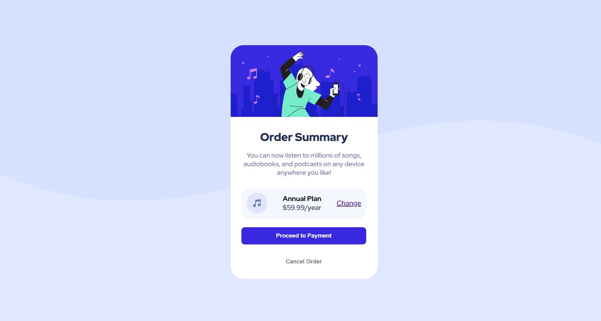

# Frontend Mentor - Order summary card solution

This is my personal solution to the [Order summary card challenge on Frontend Mentor](https://www.frontendmentor.io/challenges/order-summary-component-QlPmajDUj). I'd be happy to hear any constructive feedback on my solution especially in relation to implementing the background and refactoring my current code.

## Table of contents

  - [Screenshot](#screenshot)
  - [Links](#links)
  - [Built with](#built-with)
  - [Author](#author)

### Screenshot
##### Desktop View - Below

##### Mobile View - Below

### Links

- Solution URL: [https://github.com/jacksen30/Order-summary-component-frontend-mentor-project]
- Live Site URL: [https://order-summary-component-challenge-fe.netlify.app/]

### Built with

- Semantic HTML5 markup
- CSS 3 

## Author

- Website - [Jacksen Nillson](https://www.quotemkr.com)
- Frontend Mentor - [@jacksen30](https://www.frontendmentor.io/profile/jacksen30)